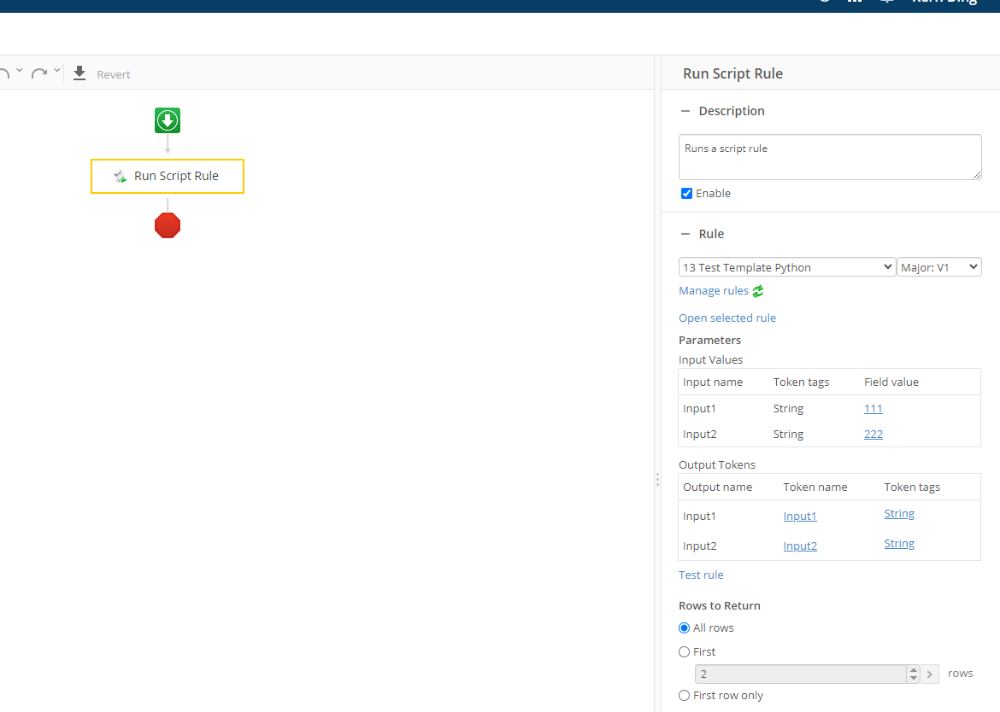

# Laserfiche Python Rule script Template project

This project is a template for creating a Laserfiche Python Rule script project. It contains a sample script that can be used as a starting point for creating your own script.

## Deploy script to your remote agent

- Copy the content of the bundle output folder `\dist` to your remote agent folder
    - e.g., `C:\Program Files\Laserfiche\Server\RemoteAgent\ScriptRunner\Python\script`

## Configure and test this script rule in your Laserfiche Cloud Account -> Process Automation -> Rules

- Create a new rule
    - Select the script rule type: Python
    - Script location: `ProcessAutomationWorker\bin\Scripts\python\template\template.py`
    - Input:
        - Name1
        - Name2
    - Output:
        - Name1
        - Name2

  

## Test the rule

- Providing two string inputs, this script would echo the inputs

## Test script rule in a workflow

- Run the workflow and verify the script echo the inputs

## Build and Test script

This project is using a mono-repo structure with multiple packages. Please refer to the documentation for more details.

- Clone this GIT repository
- Install: `pipenv install --dev`
- Test: `pytest`
- Build: `pipenv run python setup.py sdist`

### Note for bundling

- In all the sample packages, we are using ***setuptools*** to bundle all the code (include internal and external dependencies) into a single file. This is not required, but it makes it easier to deploy the code to the remote agent.
- You can also ***copy the folder*** of source code package into remote agent and 